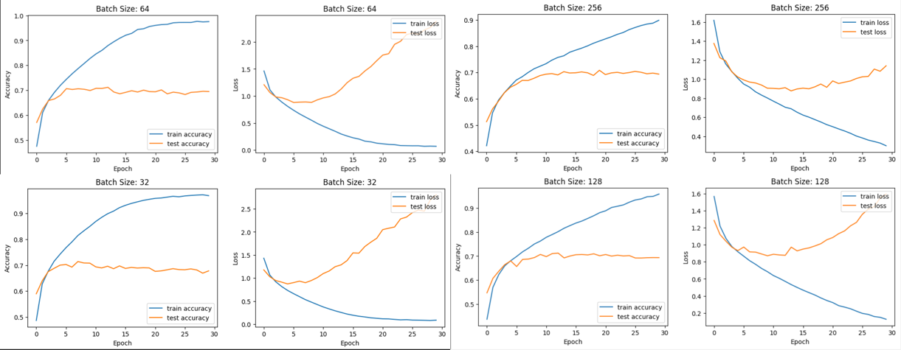
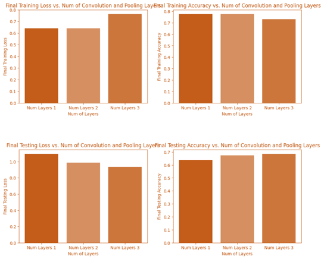

# CNN-Architectural-Variations-Performance-Study
>In this project, I investigate how various architectural modifications within a Convolutional Neural Network (CNN) impact its ability to classify CIFAR-10 images. Specifically, I explore the effects of Batch Normalization, Dropout, the number of convolution and pooling layers, and different activation functions on the model's performance.

## Experiment Details and Findings
Created, compiled and trained base CNN model with 7 layers and Relu activation Fn, plotted the output Accuracy and LossResult: Found the Accuracy and loss to stabilize at around 30 Epochs for training data with respective values as shown:

### Experiment 1: Batch Normalization

I evaluated the model performance across different batch sizes to find the optimal setting for accuracy and loss ratio. Iterated over a range of Batch values [32,64,128,256] with a Base CNN of 5 layers. The experiment revealed that a batch size of 64 achieves higher accuracy, while a batch size of 128 offers a better balance between accuracy and loss.

Result: Found the batch size of 64 ideal for more accuracy and batch size of 128 ideal for the combination of accuracy to loss ratio.

### Experiment 2: Dropout
By varying dropout rates (0.2, 0.4 & 0.5), I discovered that a dropout rate of 0.4 provides the best compromise between accuracy and loss for the model when evaluating testing data.

### Experiment 3: Convolution and Pooling Layers
The experiment on varying the number of convolution and pooling layers indicated that models with more layers show improved generalization capabilities, particularly noted by the decreased discrepancy between training and testing accuracy.

### Experiment 4: Activation Function
Among the tested activation functions (ReLU, Tanh, Sigmoid, Swish), ReLU demonstrated the best performance in terms of achieving the highest accuracy and lowest loss on test data.

## Technical Implementation

### Dependencies
TensorFlow: For building and training the CNN models.
Keras: TensorFlow's high-level API for easy model construction.
NumPy: For numerical operations and data manipulation.
Matplotlib: For plotting and visualizing the data and results.

### File Structure
BatchNormalization.ipynb: Analyzes the impact of batch normalization on model performance.
DropOutRates.ipynb: Examines the effects of varying dropout rates.
ConvolutionPoolingLayers.ipynb: Investigates how different numbers of convolution and pooling layers affect the model.
ActivationFunction.ipynb: Compares the performance of various activation functions.

## Usage Instructions
Ensure all dependencies are installed in your Python environment.
Clone the repository and navigate to the project directory.
Open and execute each notebook to replicate the experiments or to conduct your analysis.
Visualize the results within the notebooks for comprehensive insights into the model's performance under different architectural modifications.

## Conclusion
This detailed exploration provides valuable insights into how specific architectural choices can significantly influence the performance of CNN models. These findings underscore the importance of thoughtful experimentation in the design of deep learning models for image classification tasks.

